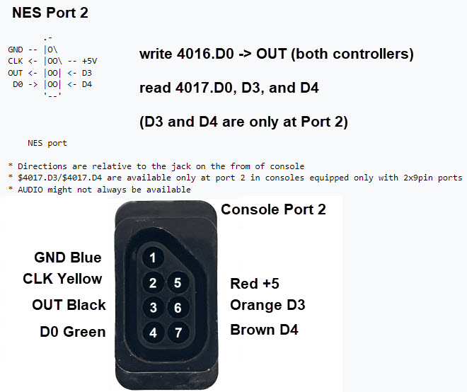

# Development on the old Nintendo NES

Journal here: [Journal](journal.md)

[Building a Development Cartridge](CARTRIDGE.md)

## Links

I bought this book:

https://www.manning.com/books/classic-game-programming-on-the-nes

Emulator (single file for windows):

https://github.com/SourMesen/Mesen2

For syntax highlighting, I'm using the plugin: https://marketplace.visualstudio.com/items?itemName=EngineDesigns.retroassembler

The code tools are my own (TODO link to opcodetools)

## Serial connection

My experiments show that the OUT signal D0 and the input signals D0, D3, and D4 are available at Port 1 and Port2.

On my hacked cable, the colors are:
  - OUT (4016 D0): Black
  - D0 (4016 D0): Green
  - D3 (4016 D3): Orange
  - D4 (4016 D4): Brown

