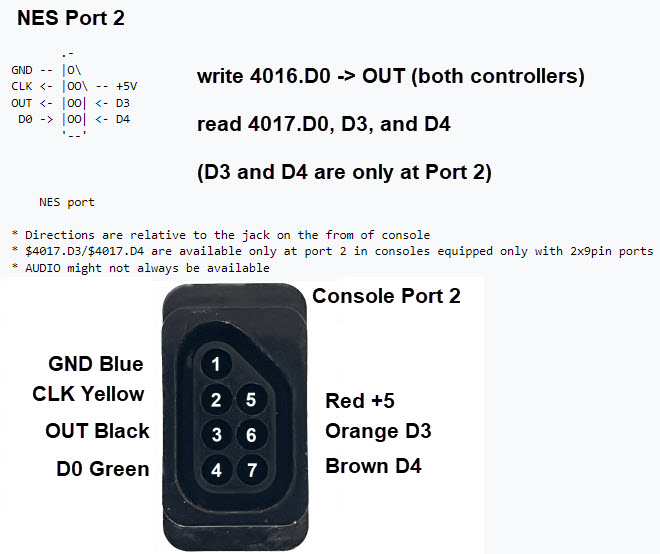

## Serial connection

My experiments show that the OUT signal D0 and the input signals D0, D3, and D4 are available at Port 1 and Port2.

On my hacked cable, the colors are:
  - OUT (4016 D0): Black
  - D0 (4016 D0): Green
  - D3 (4016 D3): Orange
  - D4 (4016 D4): Brown

