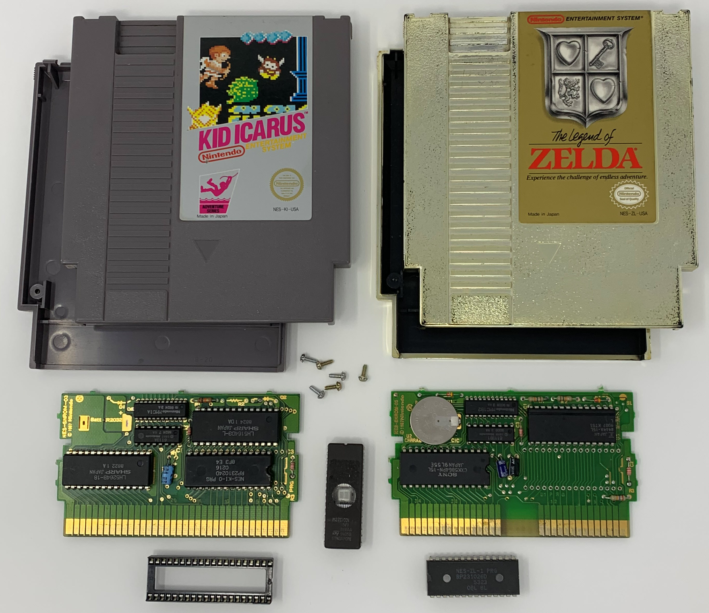
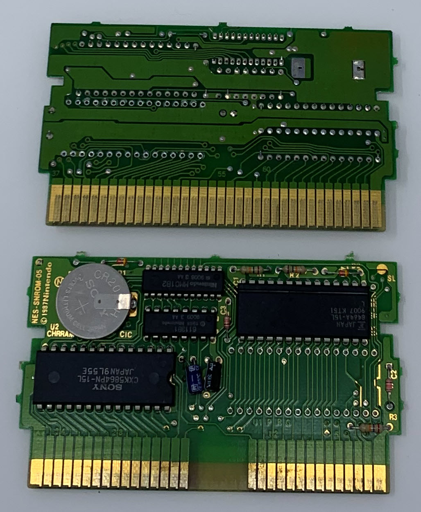
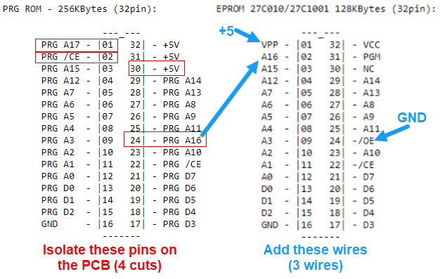
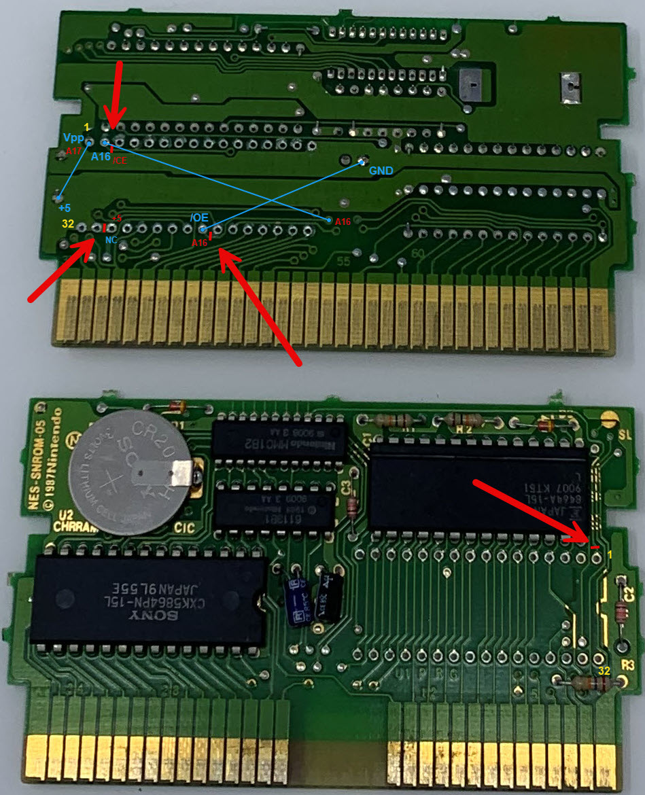
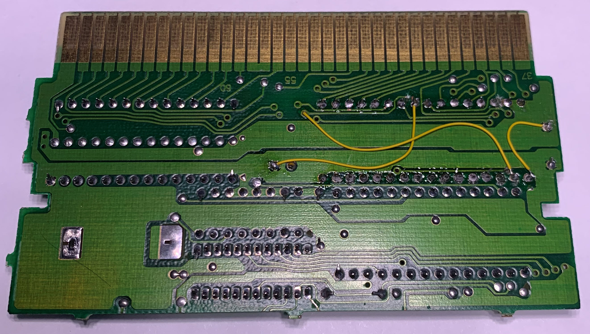
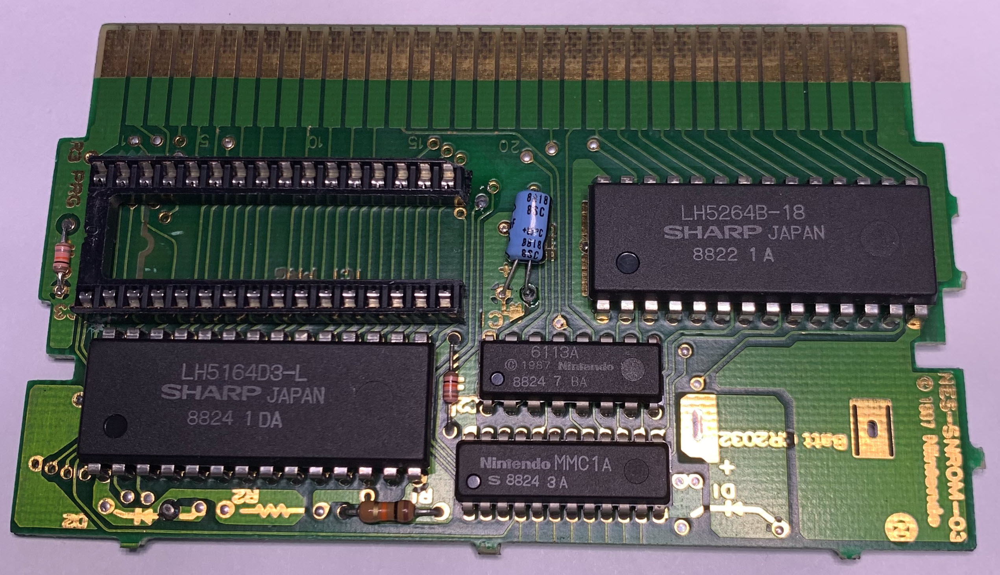
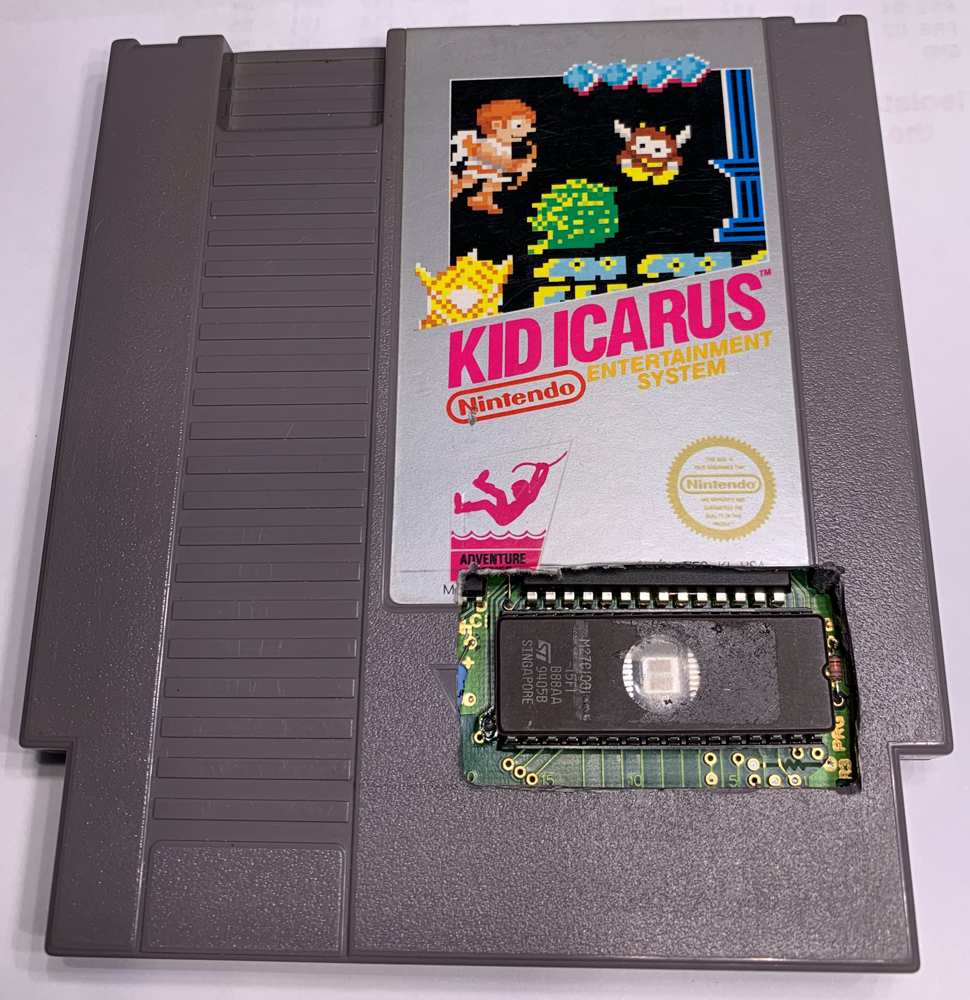

# Hacking a Cartridge

I bought my two favorite NES games to hack: Kid Icarus and The Legend of Zelda.

Both boards use the MMC1 memory mapper, but the Zelda board has a battery backup 
for the RAM. 

I used the solder vaccum at work to remove the program ROM from each board.

Here is a closeup of the Zelda board with program ROM removed.

I used a 27C010 128Kb UV-erasable EPROM. The cartridge hardware supports 256Kb program ROMs. One day
I might upgrade to 27C020 with an additional connection for A17. For now, 128Kb is plenty!

The Nintendo program ROMs have no OE (output enable) pins. All the hacks I saw on the web say to
ground OE on the EPROM.

First, I isolated four of the pins from the original PCB. You can see the four cuts in the photo below (one
cut is on the top of the board).

Next, I rerouted the three signals shown with small wires. If you want to use 27C020 256k EPROMS, add a
wire from pin 1 to pin 30 for A17. This modification should allow you to use either 27C020 or 27C010,
but I have not tested it.

The socket EPROM is too tall for the cartridge case. I'm use a modified Zelda board, but I cut a window
in the Kid Icarus case. I couldn't bring myself to mangle that awesome gold Zelda case!

The modified cartridge barely fits into the slot on my NES. I had to press down on the EPROM firmly to seat
it as low as possible. I ended up opening my NES and removing a metal bar that limits the cartridge height.

