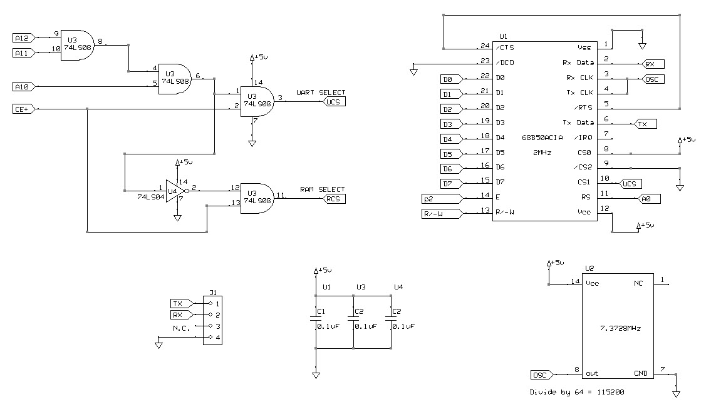
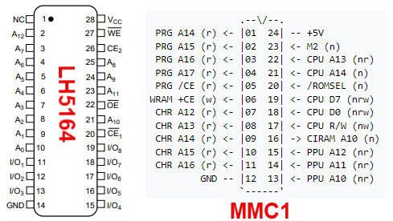
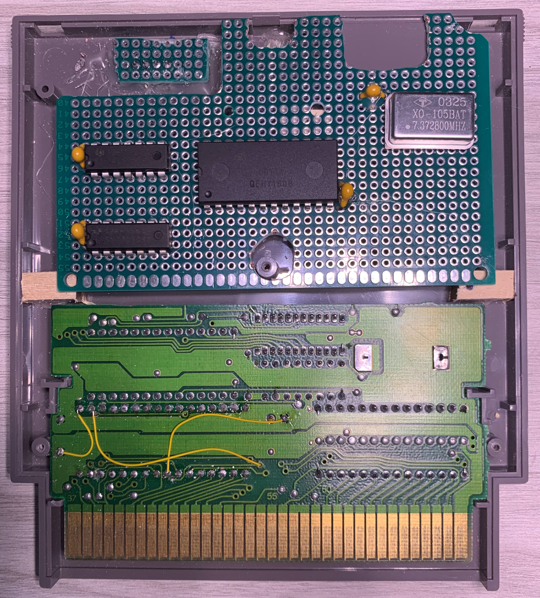
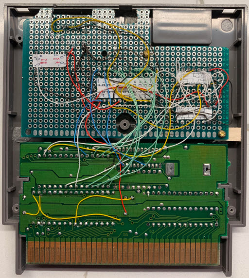
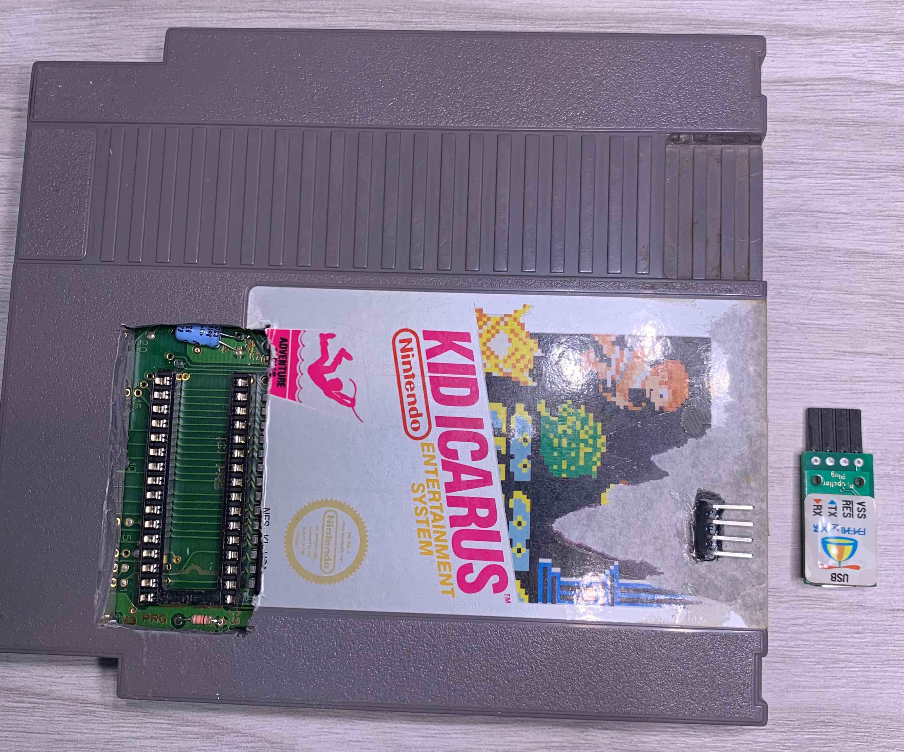
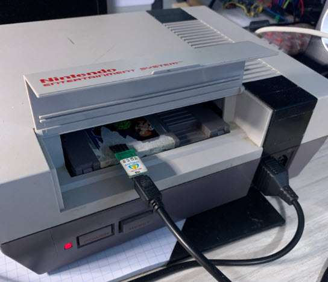
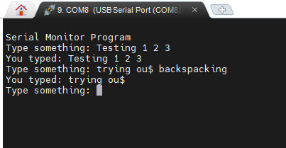

# Adding a True Serial Port to the NES

I've used the 6850 ACIA chip in other projects. Here is is in my single-board 6502 computer:

https://github.com/topherCantrell/retro-SBCs/blob/main/6502/SCHEMATICS.md

I added the same circuit to the NES Kid Icarus cartridge. Here is the schematics showing the
address decoding:

The NES area from 4000ish to 6000 is unmapped by the hardware and is available for expansion
devices. I could have mapped the ACIA chip in that area, but I wanted to use the existing
RAM chip-enable line from the MMC1. The MMC1 activates the RAM area from 6000-8000, and my
address decoding selects the RAM for the first 7K or the ACIA chip in the last 1K.

  - 6000-7BFF RAM
  - 7C00 ACIA control/status
  - 7C01 ACIA data read/write
  - 7C02-7FFF ACIA ghosting

The Kid Icarus cartridge uses a standard 8K RAM chip. The pinouts are shown below. The MMC1 memory
mapper chip is also shown. On the Kid Icarus board, the "WRAM +CE" signal from the MMC1 connects
to pin 26 "CE2" of the RAM. Notice this is an active high signal.

I cut the trace between the MMC1 and CE2 and inserted my decode circuit shown in the schematics.
The 6850 chip also needs M2 and R/W signals from the CPU. I tied in to the pins of the MMC1 for
these. The 6850 chip needs A0 and D0-D7. I tied into the RAM chip for these.

I made a prototype board to fit in the Kid Icarus cartridge. Below, you can see the chips and
decoupling capacitors. The silver can in the upper right corner of the board is the 7.3728MHz
oscillator. The 6850 chip divides that by 64 to produce the 115200 serial rate.

I used 30AWG wirewrap wire and soldered the connections point to point:

I used a right angle header for the serial lines. You can see the pins poking through the
cartridge in the picture below. You also see my FTDI USB serial dongle. That particular one
is from way back in my Parallax Propeller days.

Here is the final cartridge in action:

I used the [Bitbang Serial Controller](../bitbangSerial/README.md) to peek and poke the registers
at 7C00 and 7C01. I also peeked and poked RAM locations to make sure RAM worked.

Here is an echo program running on the NES:

